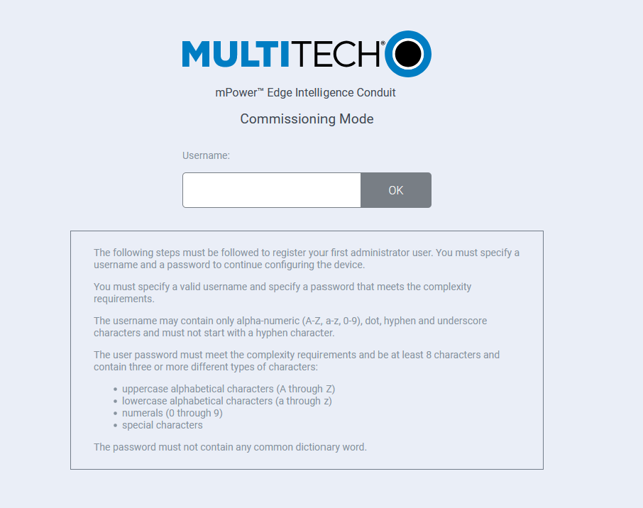
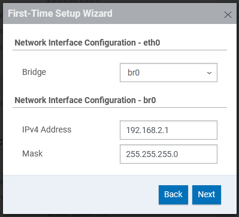
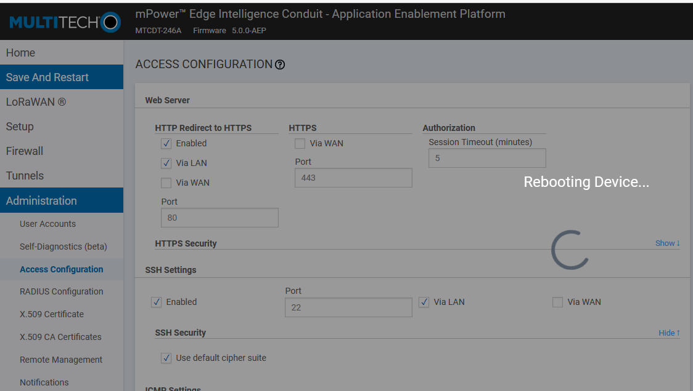

# Initial Setup for Conduit MTCDT or MTCAP

## Initial provisioning

There are two approaches: with a USB-Ethernet adapter, or with a special command on a Linux machine. Generally, the special command is easier.

### With a USB adapter

Get a USB network adapter.

Set it to static, IP 192.168.2.200

Connect Conduit and boot up

Wait for flashing status light -- it takes a while.

### Using IP magic on a Linux machine

It's easy enough to dual home the Ethernet adapter on your Linux machine, and with this you can simply set up the machine on your engineering network.

```bash
sudo ip address add 192.168.2.200/24 dev eth0  # change "eth0" to the right name for your system
```

## For mPower Systems (AEP)

Connect to 192.168.2.1 with a web browser. Accept the self-signed cert warning.



Set the default user to `admin`, and use the mLinux 12-26 default root password as the password for `admin`.

Log in. Click through the setup wizard. At the network prompt, just accept the defaults (if it looks like this):



Use Administration > Access Configuration > SSH Settings > [x] Enabled, [x] via Lan.  Then "Save and Restart" (or "Save and Apply" on more receet mLinux).

If you need to reboot:



The Conduit STATUS light will double flash for about a minute. Then the Conduit will stay at 2 lights solid on for about two minutes. Once the STATUS light starts flashing again (or you get a login prompt on the dashboard), you can log in and complete the process.

Log in using SSH:

```bash
ssh admin@192.168.2.1
```

You will likely have to delete an old host key from your `known_hosts` file.

Confirm that all looks good.

Back on the PC, do the following. (The following is for Cygwin on a PC, Linux is mutatis mutandis.)

```bash
cd /cygdrive/c/tmp
mkdir mtcdt
cd mtcdt
wget https://ttni.tech/mlinux/images/mtcdt/5.3.31/ttni-base-image-mtcdt-upgrade.bin
```

The above only needs to be done once, to get the required file.

Then, from the `mtcdt` directory from above:

```bash
scp -p ttni-base-image-mtcdt-upgrade.bin admin@192.168.2.1:/tmp
```

The `scp` takes about thirty seconds.

For cellular gateways, you need to disable the firmware version check:

```console
admin@mtcdt:~$ sudo vi /etc/init.d/umountfs
... find the line
if ! mts_fw_check_hw_support_mp "$mpower_version" "$hw_version; then
... and change to:
if false; then
```

Or if you're brave:

```bash
sudo sed -i -e '/if.*mts_fw_check_hw_support/s/if.*/if false ; then # &/' /etc/init.d/umountfs
```

Log in again, and apply the firmware:

```console
admin@mtcdt:~$ sudo /usr/sbin/mlinux-firmware-upgrade /tmp/ttni-base-image-mtcdt-upgrade.bin
Password:
firmware_upgrade: Checking MD5 for uImage.bin...
-: OK
firmware_upgrade: Checking MD5 for rootfs.jffs2...
-: OK
firmware_upgrade: Rebooting

Broadcast message from root@mtcdt (pts/0) (Mon Feb  8 00:40:00 2021):

The system is going down for reboot NOW!
admin@mtcdt:~$
```

You'll see lights flashing, then three lights solid, then two lights solid. At the two-light-solid point, the Conduit should be waiting for DHCP; connect it to the provisioning network and find it's IP address.  Use a Linux system for the following.

```console
$ for i in $(seq 1 255); do   { ( ping -c2 -W1 192.168.1.$i |& grep -q '0 received' || echo 192.168.1.$i > /dev/tty ; ) & disown; }; done >& /dev/null
...
$ sudo arp -vn | grep '00:08:00' | tr : - | sort -k1.11n | awk '{ printf("%s\t%s\tTYPE\n", $1, $3) }'
...
192.168.1.56	00-08-00-4a-f0-90	TYPE
```

Login using:

```bash
ssh mtadm@192.168.1.56
```

The password is the mLinux 5.3.0b/5.3.31 default password.

Manually install the root ssh key in /root. Use the normal conduit public key, tmm-conduit.pub.

```
$ sudo -i
Password: 
# cd ~root
# mkdir -m 700 .ssh
# printf '%s\n' '...body of key...' > .ssh/authorized_keys
# chmod 600 .ssh/authorized_keys
# exit
$
```

Then confirm that you can ssh in as `root`.

Once on the provisioning network, follow the instructions in [`HOWTO-MASS-PROVISION.md`](HOWTO-MASS-PROVISION.md).
