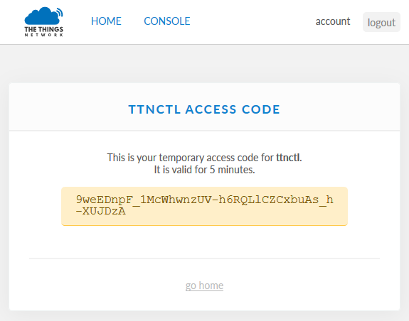

# Manufacturer's instructions for preparing a Conduit for shipping to customers

This document summarizes the theory and practice of managing Conduits (and other gateways for The Things Network) using the Ansible framework developed by Jeff Honig.

To jump to the sections, use these links:

- [Theory](#theory)
- [Practice](#practice)

Detailed contents:
<!-- TOC depthFrom:2 -->

- [Theory](#theory)
	- [Background](#background)
	- [Approach](#approach)
	- [Organizational Information](#organizational-information)
		- [The <code>org/</code> directory](#the-codeorgcode-directory)
	- [The <code>hosts</code> file](#the-codehostscode-file)
		- [host_vars/](#host_vars)
			- [host_vars/ttn-\{hostXX\}.yml](#host_varsttn-\hostxx\yml)
			- [group_vars/](#group_vars)
			- [group_vars/conduits.yml](#group_varsconduitsyml)
	- [How Provisioning Works](#how-provisioning-works)
	- [How Jump Hosts and Ports are managed](#how-jump-hosts-and-ports-are-managed)
		- [Mechanizing the hacks](#mechanizing-the-hacks)
- [Practice](#practice)
	- [Setting up your manufacturing station](#setting-up-your-manufacturing-station)
		- [Creating an organizational repo](#creating-an-organizational-repo)
			- [Using the starting point](#using-the-starting-point)
			- [Creating an organizational rebo by hand](#creating-an-organizational-rebo-by-hand)
		- [Checking out your organizational repo](#checking-out-your-organizational-repo)
		- [User names and ports on your jumphost](#user-names-and-ports-on-your-jumphost)
		- [Ansible setup on management PC](#ansible-setup-on-management-pc)
		- [Install your authorized_keys in your Ansible setup](#install-your-authorized_keys-in-your-ansible-setup)
	- [Preparing the Conduit](#preparing-the-conduit)
		- [Reflashing the Conduit](#reflashing-the-conduit)
		- [Resetting the Conduit to Factory Defaults](#resetting-the-conduit-to-factory-defaults)
	- [Setting up Conduit for Ansible](#setting-up-conduit-for-ansible)
	- [PC Setup Prerequisites](#pc-setup-prerequisites)
	- [Attaching the Conduit while in Factory State](#attaching-the-conduit-while-in-factory-state)
	- [Connect the gateway to the jumphost](#connect-the-gateway-to-the-jumphost)
	- [Do jumphost setup](#do-jumphost-setup)
	- [Quick Reference for the experienced](#quick-reference-for-the-experienced)
	- [Add the new gateway to the Ansible database](#add-the-new-gateway-to-the-ansible-database)
	- [Use Ansible to complete the setup](#use-ansible-to-complete-the-setup)
		- [Sign in to The Things Network](#sign-in-to-the-things-network)

<!-- /TOC -->

## Theory

### Background

This Ansible system manages _**gateways**_.

Gateways are associated with _**organizations**_. The gateways for an organization are managed by an _**ops team**_.  One ops team may manage gateways for several organizations.

This document is intended for use by MCCI in its role as an ops team.

The data about gateways and organizations must not be shared indiscriminately. On the other hand, the scripts and procedures for configuration management are intended to be shared (both for code reuse, and for review).

So the ops team must separate the gateway and organization data from the procedures.

For example, at MCCI we now are managing:

- MCCI's gateways in Ithaca and New York
- Lancaster's gateways in California
- The Things Network Ithaca's gateways
- The Things Network New York's gateways
- The Hualian Garden gateway

The obvious way to separate the data is to create a directory for the organization that is separate from the data for the procedure.

So the ops team at MCCI puts the data for each organization in a separate directory, corresponding to a separate Git repository.

We also need one or more _**jump hosts**_.  Jump hosts are intermediate systems that serve as a known place for contacting gateways that are otherwise not directly accessible on the internet. (Ansible documentation refers to these as _**bastion hosts**_, but that concept is more general.) The gateway connects to the jump host; management clients connect to the jump host; software on the jump host sets up tunnels so that the clients think they're talking directly to the gateways.

Some organizations will want to set up their own jump hosts. But there is not necessarily a one-to-one mapping between organizations and jump hosts; and we think that there will (long term) be many more jump hosts than clients.

Awkwardly, a given jump host must (for technical reasons) assign unique _**forwarding ports**_ for each gateway. These ports are 16-bit numbers. There must be a table for each jump host that specifies the correspondence between forwarding port number and the associated gateway.

### Approach

It may well be that we discover that what's needed is a database for the information (something stronger than `git`). But for now, we'll use `git` for storing the info, even though this probably will cause regrettable duplication of data.

When setting up an organization, the ops team can choose one of two approaches. They can have a master organization repository that includes the `ttn-multitech-cm` system as a submodule. Alternately, they can have the organization repository sit side-by-side with a separate (independent) clone of the `ttn-multitech-cm` repository. In that case, the computer system hosting the Ansible system would only need one copy; but it becomes very difficult to replicate results and track versions if there are multiple operators with laptops.  The problem with submodules is complexity -- they're not at all transparent, which makes them error prone and somewhat tedious to use.

No matter what approach the ops team chooses, each organization directory will have a `hosts` file, a `host_vars` directory with one file for each managed Conduit, and a `group_vars` directory containing at least the file `group_vars/conduits.yaml`.  These are documented below.

### Organizational Information

For the purposes of this discussion, we'll assume the following directory structure.

<pre><em><strong>toplevel</strong></em>
    .git/
    .gitignore
    org/
        hosts
        group_vars/
            conduits.yml
        host_vars/
            ttn-<em><strong>host1</strong></em>.yml
            ttn-<em><strong>host2</strong></em>.yml
            ...
            <em><strong>jumphost1</strong></em>.yml
            ...
    ttn-multitech-cm/
        .git/
        Makefile
        ...
</pre>

Note that `ttn-multitech-cm/` is a git [**submodule**](https://git-scm.com/book/en/v2/Git-Tools-Submodules). This complicates checkouts, but greatly simplifies ensuring consistency among different developers.

#### The <code>org/</code> directory

This is an Ansible [**inventory directory**](http://docs.ansible.com/ansible/latest/intro_dynamic_inventory.html#using-inventory-directories-and-multiple-inventory-sources). As such, you need to be careful to only put the `hosts` file here; all files are liable to interpretation by Ansible. We note in passing that it is possible to specify the group hierarchy separately in a `groups` or `groups.yml` file.

### The <code>hosts</code> file

The `hosts` file is an Ansible [**inventory**](http://docs.ansible.com/ansible/latest/intro_inventory.html) file. It provides the following information:

- the names we'll use to refer to each of the known systems (_**hosts**_) that are to be controlled by Ansible; and
- the _**groups**_ to which hosts belong.

A host always belongs to at least two groups, <code>[all]</code>, which contains all hosts, and some more specific group. Hosts that appear before the first header will be placed in the `[ungrouped]` group.

Hosts have associated _**variables**_. These are values associated with the host, which can be queried by Ansible components. This allows for host-by-host parameterization.

In our context, each gateway that we want to control is defined as a host in the inventory.

Hosts are normally (but not always) given names that correspond to their DNS names. Since our gateways often will not be visible in DNS, the names we assign to our gateway hosts are not DNS names. The names conventionally follow the pattern <code>ttn-<em>orgtag</em>-<em>gatewayname</em></code>, where <code><em>orgtag</em></code> is the same for all the gateways in the organization.

The `hosts` inventory file is usually structured like a Windows `.ini` file.

- Lines of the form `[something]` are headers
- Other lines are content related to the header

Header lines come in three forms:

- Lines of the form <code>[<em>groupname</em>]</code> start a section of host names. Each host named in the section belongs to the specfied group (and to all the groups that are parents of the specified group).
- Lines of the form <code>[<em>groupname</em>:vars]</code> start a section of variable settings that are to be defined for every host that's part of group <code><em>groupname</em></code>.
- Lines of the form <code>[<em>groupname</em>:children]</code> start a section of sub-group names, one name per line. Each group named in the section belongs to the parent group <code>[<em>groupname</em>]</code>.

Groups are used in two ways:

- they define specific subsets of the hosts in the inventory; and
- they provide specific variable values that are associated with each host in the group.

Although it is technically possible to put host and group variable settings in the inventory file, standard practice is to put the settings for a given host in a separate file. This file is a YAML file, and it lives in the `host_vars` directory next to the `hosts` inventory file, and is named <code><em><strong>hostname</strong></em>.yml</code>.

#### host_vars/

This directory contains information (in the form of variable settings) about each of the gateways, one file per gateway. For convenience, information about the jump hosts is also placed in this directory, one file per jump host.

##### host_vars/ttn-\{hostXX\}.yml

To be treated as a gateway description and acted upon, a given file, `ttn-{hostXX}` must appear in the `hosts` file under a `[Conduits]` section (typically in a subsection). Otherwise the file is ignored.

In the `ttn-multitech-cm/host_vars/` directory, you can find a sample file, `ttn-org-example.yml`, which can be used as a starting point. Make a copy in your organization's `host_vars` directory with the appropriate name to match the name used in your `hosts` file.

##### group_vars/

This directory contains information (in the form of variable settings) about each of the groups, one file per group. The file for group <code>[<em>groupname</em>]</code> is named <code>group_vars/<em>groupname</em>.yml</code>.

##### group_vars/conduits.yml

This file contains information (again, in the form of variable settings) that apply to all gateways that are in the `[conduits]` group in the inventory.

### How Provisioning Works

1. The Conduit is initially in factory state, and has static IP address of `192.168.2.1`.

2. <a name="Provisioning-Setup-item"></a>The provisioning system is set up like this:
   

3. The provisioning operator runs a script PC changes the Conduit to use DHCP (if this is what the final network location will use). If the final network location will not use DHCP, the remaining steps will have to be performed on the final network. We strongly advise use of DHCP, if possible.

4. Either the operator forces a DHCP cycle, or reboots the Conduit, or optionally, the operator moves the Conduit to another physical location.  In any case, the router then:

   1. assigns the Conduit a new address,
   2. sets up the initial authorized key file for use during the rest of the provisioning process, and
   3. tells the Conduit what its gateway is (`192.168.2.254` in this case).

5. The provisioning PC connects to the Conduit using ssh (root/root), and does the following initial setup.

   1. Install the starting point for Ansible

6. Either manually, or using Ansible, the following steps are performed. To do using Ansible, a new `provision.yml` is needed, and the inventory has to be a special provisioning inventory.

   1. Generate a private key to be used for autossh key, and fetch the public key to be stored in the database for the Conduit.
   2. Establishes an autossh to the initial jumphost using the assigned port number.
   3. Installs an initial authorized_keys file for root login using the ops team key.
   4. Disables password-based login for root via ssh.

7. The provisioning PC installs the public key for the new Conduit on the jumphost.

8. At this point, the Conduit is able to log into the jumphost, and the configuration looks like this:

    

    For clarity, we show the databases on the Provisioning PC in this diagram.

    Now, instead of the PC connecting directly to the Conduit, all connection is made via the Jumphost. As long as the Conduit is provisioned using DHCP, the entire remainder of provisioning can be done via normal Ansible operations.

### How Jump Hosts and Ports are managed

Every remote device connected via the jump host must have three unique "port numbers" (or "ports") assigned. These ports are used for TCP/IP communication, and must be different from each other, and from the port numbers assigned for any other devices managed by the jump host.

There are two kinds of ports.

1. The **SSH tunnel port** is the port that we use when logging into the gateway.

2. The **keepalive ports** are ports that are used internally by the software to detect when a connection between the device and the jumphost has been broken. For technical reasons, these ports are always assigned in pairs (e.g., 40004, 40005; or 50124, 50125). We only specify the first port of the pair. Software assumes that the second port is equal to the base port number, plus one.

The port numbers have to be in the range 1,024 to 65,535.

So in theory we need to keep track of both the SSH tunnel port and the keepalive base port, and make sure we don't assign the same number twice.

This could be a big problem; ideally the jumphost itself would have a web interface for assigning free ports and doing the local setup, plus an API to be used by Ansible.

But instead we assign a single number as the SSH tunnel port, and then derive the base port from that using arithmetic.  To assign the SSH tunnel port, we take advantage of the Unix "add user" process, which will assign a small number as the "user ID". We arrange for this ID to be numerically special -- unlike normal Unix user IDs, which typically start at 1000, we use a much higher starting point -- 20000 in this version. We create a user for each gateway on the jumphost during provisioning, using the Ethernet MAC address as the last portion of the name.

Here's the first part of the hack. **_We use the UID as the SSH tunnel port number_.**

There are two kinds of TCP/IP port numbers, distinguished by their numerical value: _well-known_ ports, which are in the range 0..1023, and __registered ports__ (in the range 1024..65535). (These terms are from [RFC 1700](http://www.ietf.org/rfc/rfc1700.txt).) On most systems, it's inconvenient for user programs to use well-known ports. In this scheme, it's important that each gateway listen on a unique port, and they can't use well-known ports. Since our UIDs are unique for each gateway, and they're in the reserved range, we can use the assigned UID directly as the port number.

(We're assuming that we're tightly controlling all the other activity on the jump host, so we don't have to worry about other programs using ports that collide with our assignments.)

This has the delightful side effect that the open port numbers shown in `netstat -ln` can be readily converted to the gateway ID, using <code>getent passwd <em>portnum</em></code>.

To assign the keepalive base port, we simply map the SSH tunnel port from [20000..20000+n-1] to [30000..2*(n-1)]. In other words, 20000 maps to 30000 and 30001, 20001 maps to 30002 and 30003, and so forth. This approach limits us to ten thousand keepalive base ports on a given jump host; this limitation is acceptable for now.

#### Mechanizing the hacks

The [second stage configuration script](https://gitlab-x.mcci.com/client/milkweed/mcgraw/conduit-mfg#do-stage-2-setup) creates a user for each gateway, and records the assigned user ID (which is the SSH tunnel port for that system).

The script then calcluates the related prints out the derived information in a form that can be used to update the provisioning files. Of course, it would be relatively simple for Ansible to automatically update the organizational database files, but that's not been done yet.

The second stage provisioning process further creates the group <code>ttn-<em>orgname</em>-gateways</code> on the jump host, if doesn't already exist. That group is used for all the gateway users. The provisioning process disables the default "create unique group per user" default in `useradd`, because we don't need it for this application.

**Caution:** The jump host server is a single point of failure for provisioning; it must be backed up.

## Practice

This section gives procedures for setting up a Conduit, assuming the theory outlined [above](#Theory).

### Setting up your manufacturing station

This procedure requires the following setup. (See [the figure](#Provisioning-Setup-item) in the Theory section, above.)

1. A router connected to the internet. It must be set up for NAT, and the downstream network must be set for `192.168.2.0/24`. Its address on the network should be `192.168.2.254`. It should be provisioned to offer DHCP to downstream devices. The recommended downstream setup is to set aside a pool starting at `192.168.2.1` of length 1; this is most flexible. However, you can make the procedure work with a dedicate USB-Ethernet adapter and moving the Ethernet cable to a DHCP-capable router with access to the host at the right moment.

2. A Ubuntu system or VM with:

    - Ubuntu-64 16.04LTS
    - Ansible
    - The other pre-requisites from [https://github.com/IthacaThings/ttn-multitech-cm](https://github.com/IthacaThings/ttn-multitech-cm)
    - Your organizational repo.

    This system needs to be connected to a downstream port of the above router. It must have an address other than `192.168.2.1`!

    Follow the procedure given in [Ansible setup](#section-ansible-setup) to confirm that your Ansible installation is ready to go.

3. A spare Conduit accessory kit (power supply, Ethernet cable, RP-SMA LoRaWAN antenna).

    **NOTE**: the Conduit accessory kit is not strictly required; but using a separate accessory kit means that you won't have to open up the end-user's accessory kit.

#### Creating an organizational repo

There is a "starting point" repo you can clone. Or you can do it by hand.

##### Using the starting point

1. Create a repo on your favorite git server. The canonical name is of the form <code>org-<em>myorgname</em>-gateways.git</code>; change <code><em>myorgname</em></code> to something appropriate.  Leave the

2. Clone the starting point repo

   ```bash
   git clone --recursive    git@gitlab-x.mcci.com:client/milkweed/mcgraw/org-ttn-INITIAL.git    org-ttn-MYORGNAME-gateways
   ```

3. Change the remote pointers

   ```bash
   cd org-ttn-MYORGNAME-gateways
   git remote rename origin template
   git remote add origin {GIT-REMOTE-URL-HERE}
   ```

4. Edit the README.md

5. Commit changes:

   ```bash
   git add README.md
   git commit -m "Localize README.md for MYORGNNAME"
   ```

6. Seed your new remote repo.

   ```bash
   git push -u origin --all
   git push -u origin --tags
   ```

##### Creating an organizational rebo by hand

To create one by hand:

1. Create a repo on your favorite git server. The canonical name is of the form <code>org-<em>myorgname</em>-gateways.git</code>; change <code><em>myorgname</em></code> to something appropriate.
2. Add a `README.md` through the web interface, including the checkout instructions (like [this](https://gitlab-x.mcci.com/client/milkweed/mcgraw/org-ttnnyc-gateways/blob/master/README.md)):

    ```markdown
    # Organizational database for TTN NYC gateways

    This repo contains the info and links to procedures required for setting up gateways
    managed by The Things Network New York.

    It contains submodules. Therefore, the checkout procedure has two steps:
    1. git clone as usual.
    2. Then `git submodule init && git submodule update`.

    A one-step approach is `git clone --recursive`, but generally one forgets to do this!

    See the documentation in [conduit-mfg](https://gitlab-x.mcci.com/client/milkweed/mcgraw/conduit-mfg).
    ```

3. Clone the repo to a dev system.
4. Change directory into the repo.
5. On the dev system, add the [ttn-multitech-cm](https://github.com/IthacaThings/ttn-multitech-cm.git) repository as a submodule using the following command.

    ```bash
    git submodule add https://github.com/IthacaThings/ttn-multitech-cm
    git commit -m "Add Ansible procedures"
    ```

6. Create the initial variable directories.

    ```bash
    cp -R ttn-multitech-cm/*_vars .
    cp ttn-multitech-cm/hosts .
    git add .
    git commit -m "Seed initial organizational variables"
    ```

#### Checking out your organizational repo

The easy way:

```bash
git clone --recursive https://github.com/SomeUser/org-SomeOrg-gateways.git
```

The hard way:

```bash
git clone https://github.com/SomeUser/org-SomeOrg-gateways.git
git submodule init && git submodule update
```

#### User names and ports on your jumphost

See [How Jump Hosts are managed](#how-jump-hosts-are-managed) for the theory. The practice is automatic and happens as part of [second stage set-up](#do-stage-2-setup).

<a name="section-ansible-setup"></a>

#### Ansible setup on management PC

You need to have a relatively recent version of Ansible installed on your management PC.
Follow [the instructions](http://docs.ansible.com/ansible/latest/intro_installation.html#latest-releases-via-apt-ubuntu)
to get things set up properly.

After installation, check the version:

```console
$ ansible --version
ansible 2.4.1.0
  config file = /etc/ansible/ansible.cfg
  configured module search path = [u'/home/tmm/.ansible/plugins/modules', u'/usr/share/ansible/plugins/modules']
  ansible python module location = /usr/lib/python2.7/dist-packages/ansible
  executable location = /usr/bin/ansible
  python version = 2.7.12 (default, Nov 19 2016, 06:48:10) [GCC 5.4.0 20160609]
```

When things are working, `make syntax-check` should work, more or less (with some grumbles about jumphost.example.com).

#### Install your authorized_keys in your Ansible setup

This is unfortunately something that has to be done (at present) by updating the Ansible procedure files. We've got an issue filed on this, [#19](https://github.com/IthacaThings/ttn-multitech-cm/issues/19).

Using the shell, create the `authorized_keys` file as follows:

```bash
cat {path}/keyfile1.pub {path}/keyfile2.pub ... > ttn-multitech-cm/roles/conduit/files/authorized_keys
```

**TODO:** have a simpler setup. Have the makefile create a symlink, perhaps, and use a `.gitignore` so that the symlink doesn't get committed by accident?

### Preparing the Conduit

If the Conduit is not an mLinux variant (is an AEP variant), then you must
re-flash the Conduit with an mLinux version.

#### Reflashing the Conduit

TO BE SUPPLIED -- NOT NORMALLY REQUIRED

#### Resetting the Conduit to Factory Defaults

Reset the Conduit to factory defaults by powering on, then pressing and holding
the front-panel RESET button for 5 seconds.  Let the Conduit complete its
reboot and reinitialization sequence.

### Setting up Conduit for Ansible

From the [factory](http://www.multitech.net/developer/software/mlinux/getting-started-with-conduit-mlinux/),
the Conduit's initial IP address is `192.168.2.1`.

In this first step, we'll do the following.

1. Connect to the Conduit via a dedicated Ethernet port.
2. Set up the Conduit for DHCP and set up the auto-SSH tunnel to the jumphost
3. Ansible control.
4. Restart.

### PC Setup Prerequisites

You need a specially-prepared NAT-ing IPv4 router -- a Wi-Fi gateway + router works well -- plus a Ubuntu 16.04 LTS amd64 PC. (This PC can be running in a VM on Windows.)

1. Make sure the NAT-ing router is connected to the Internet. DMZ is fine; or it can be on a corporate network.
2. Configure the NAT-ing router so that it's inner network is `192.168.2.0/24`.
3. Make sure the NAT-ing router's address on the inner network is `192.168.2.254`.
4. Set up the Ubuntu PC (or Windows host that is hosting the Ubuntu VM) a static network address on the NAT. Recommended address is `192.168.2.127`.
5. If you're doing one Conduit at a time, try setting up the NAT-ing router so that the dynamic address pool begins *and ends* with `192.168.2.1`. This means that the Conduit under test will be at `192.168.2.1` even after the switch to DNS, and it may mean that you can completely avoid use of the USB terminal. However, if you can't do this, the USB terminal is simple.

### Attaching the Conduit while in Factory State

1. Verify that networking is running, by pinging `8.8.8.8` from the Ubuntu system.

2. If necessary reset the Conduit to factory state.

3. Connect the Conduit to the router using the Ethernet cable and let it boot up.

4. Ping the Conduit:

    ```shell
    $ ping 192.168.2.1
    PING 192.168.2.1 (192.168.2.1) 56(84) bytes of data.
    64 bytes from 192.168.2.1: icmp_seq=1 ttl=64 time=0.805 ms
    64 bytes from 192.168.2.1: icmp_seq=2 ttl=64 time=0.780 ms
    ^C
    --- 192.168.2.1 ping statistics ---
    2 packets transmitted, 2 received, 0% packet loss, time 1024ms
    rtt min/avg/max/mdev = 0.780/0.792/0.805/0.030 ms
    ```

5. SSH to the Conduit:

    ```shell
    $ ssh root@192.128.2.1
    $ ssh root@192.168.2.1
    Password:
    Last login: Sat Sep 30 02:06:07 2017 from 192.168.2.127
    root@mtcdt:~#
    ```

    At this point, the time is very likely to be wrong. The upstream gateway isn't set, so you can't do anything. And Ansible isn't set up. But we'll change that in a moment.

6. Check the mLinux version:

    ```shell
    root@mtcdt:~# cat /etc/mlinux-version
    mLinux 3.3.13
    Built from branch: (detachedfromecc3f47)
    Revision: ecc3f47d9fb7e9477aeb0bf2503217aa64082afd
    ```

    If the version is not at least 3.3.1, **stop** -- you have to upgrade to a newer version of mLinux before you can proceed.

### Connect the gateway to the jumphost

1. Prepare a suitable SSH public key file. In this example, we use `conduit.pub`.

2. **On the managment PC:**

   Run the script `generate-conduit-stage1` to generate the stage 1 configuration file.

    ```console
    cd ${SANDBOX}/ttn-multitech-cm
    roles/conduit/files/generate-conduit-stage1 ~/.ssh/conduit.pub > /tmp/conduit-stage1
    ```

    By default, this generates a script suitable for use when logging into the Conduit via Ethernet. This is your only option if configuring a Conduit AP. If configuring a Conduit 210 or 246, you have the option of using a USB connection.  In that case, consider editing `generate-conduit-stage1` to enable `OPTUSBSER`, and regenerate `/tmp/conduit-stage1` if needed.

3. **On the management PC:** Use scp to copy the file to the Conduit.

    ```shell
    CONDUIT=192.168.2.1
    scp -p /tmp/conduit-stage1 root@${CONDUIT}:/tmp
    ```

    You'll be prompted for root's password.

4. Now we need to run the script.

   - **Via Ethernet:** Log into $CONDUIT, and run the script you've just copied over. The Conduit will set up for DHCP. If the Conduit is not on a network with a DHCP servier, you will need to move the cable to a network segment. The output looks like this:

      ```console
      tmm@Ubuntu16-04-02-64:~/sandbox/ttn-multitech-cm$ ssh root@${CONDUIT}
      Enter passphrase for key '/home/tmm/.ssh/id_rsa':
      Password:
      Last login: Fri Jan 26 15:42:05 2018 from desktop-dsjhc38
      root@mtcdt:~# sh /tmp/conduit-stage1
      All set: press enter to enable DHCP

      udhcpc (v1.22.1) started
      Sending discover...
      Sending discover...
      Sending select for 192.168.1.108...
      Lease of 192.168.1.108 obtained, lease time 86400
      /etc/udhcpc.d/50default: Adding DNS 192.168.1.1
      checking ping
      PING 8.8.8.8 (8.8.8.8) 56(84) bytes of data.
      64 bytes from 8.8.8.8: icmp_seq=2 ttl=54 time=12.3 ms
      64 bytes from 8.8.8.8: icmp_seq=3 ttl=54 time=12.5 ms
      64 bytes from 8.8.8.8: icmp_seq=4 ttl=54 time=12.2 ms

      --- 8.8.8.8 ping statistics ---
      4 packets transmitted, 3 received, 25% packet loss, time 3005ms
      rtt min/avg/max/mdev = 12.226/12.371/12.563/0.190 ms

      if ping succeeded, you're ready to proceed by logging in from the
      remote test system with ssh. Check the IP address from the ifconfig output
      below...

      eth0      Link encap:Ethernet  HWaddr 00:08:00:4A:37:6B
                inet addr:192.168.1.108  Bcast:192.168.1.255  Mask:255.255.255.0
                UP BROADCAST RUNNING MULTICAST  MTU:1100  Metric:1
                RX packets:1120 errors:0 dropped:7 overruns:0 frame:0
                TX packets:259 errors:0 dropped:0 overruns:0 carrier:0
                collisions:0 txqueuelen:1000
                RX bytes:109668 (107.0 KiB)  TX bytes:35441 (34.6 KiB)
                Interrupt:23 Base address:0xc000

      All set: press enter to restart sshd (will run in background)

      Connection to 192.168.1.108 closed by remote host.
      Connection to 192.168.1.108 closed.
      ```

   NOTE: if the Conduit previously had a static address, you may lose connectivity after "press enter to enable DHCP." Also, even if the Conduit was formerly using DHCP, you might lose connectivity -- some routers assign new addresses on each DHCP cycle. In either case, you'll need to determine the new IP address at that point.

   - **Via USB:** Run the script you've just copied over.

      ```console
      root@mtcdt:~# sh /tmp/conduit-stage1
      All set: press enter to enable DHCP

      udhcpc (v1.22.1) started
      Sending discover...
      Sending discover...
      Sending select for 192.168.1.108...
      Lease of 192.168.1.108 obtained, lease time 86400
      /etc/udhcpc.d/50default: Adding DNS 192.168.1.1
      checking ping
      PING 8.8.8.8 (8.8.8.8) 56(84) bytes of data.
      64 bytes from 8.8.8.8: icmp_seq=2 ttl=54 time=12.3 ms
      64 bytes from 8.8.8.8: icmp_seq=3 ttl=54 time=12.5 ms
      64 bytes from 8.8.8.8: icmp_seq=4 ttl=54 time=12.2 ms

      --- 8.8.8.8 ping statistics ---
      4 packets transmitted, 3 received, 25% packet loss, time 3005ms
      rtt min/avg/max/mdev = 12.226/12.371/12.563/0.190 ms

      if ping succeeded, you're ready to proceed by logging in from the
      remote test system with ssh. Check the IP address from the ifconfig output
      below...

      eth0      Link encap:Ethernet  HWaddr 00:08:00:4A:37:6B
                inet addr:192.168.1.108  Bcast:192.168.1.255  Mask:255.255.255.0
                UP BROADCAST RUNNING MULTICAST  MTU:1100  Metric:1
                RX packets:1120 errors:0 dropped:7 overruns:0 frame:0
                TX packets:259 errors:0 dropped:0 overruns:0 carrier:0
                collisions:0 txqueuelen:1000
                RX bytes:109668 (107.0 KiB)  TX bytes:35441 (34.6 KiB)
                Interrupt:23 Base address:0xc000

      All set: press enter to restart sshd (will run in background)

      root@mtcdt:~#
      ```

5. **On the management PC:** If the IP address of the Conduit changed, update the value of the CONDUIT variable.

    ```bash
    CONDUIT=192.168.1.108
    ```

    **_Remember to change the IP address to match what DHCP assigned!_**

6. **On the managment PC:** Prepare to use ssh by adding the gateway login key to your ssh agent. (Remember that you defined the keys that you will use previously; see [above](https://gitlab-x.mcci.com/client/milkweed/mcgraw/conduit-mfg#install-your-authorized_keys-in-your-ansible-setup)).

    ```bash
    if [ X"$SSH_AUTH_SOCK" = X ]; then eval `ssh-agent` ; fi
    ssh-add {path}/keyfile
    ```

7. **On the managment PC:** Verify that password-based login is disabled.

    ```console
    $ SSH_AUTH_SOCK= ssh root@$CONDUIT
    Permission denied (publickey,keyboard-interactive).
    ```

    If the Conduit lets you log in with password `root`, stop! Something has gone wrong.

### Do jumphost setup

The remaining work is done using the PC and ssh. The USB cable is no longer needed. However we still need to get the unit connected to the jump host.

Follow the instructions given in [`HOWTO-MASS-PROVISION.md`](HOWTO-MASS-PROVISION.md). Even if you're only provisioning one gateway, that procedure is the best way to do things, at least up to the point where you can verify that the gateway is connected to the jumphost.

From the development computer, test that you can now connect to the Conduit via the jumphost.

In the general case, this is:

```bash
ssh -tA  $JUMPADMIN@$JUMPHOST  ssh -A -p $JUMPUID root@localhost
```

For example:

```console
# ssh -tA tmm@ec2-54-221-216-139.compute-1.amazonaws.com ssh -A -p 20000 root@localhost
Last login: Sun Nov  5 08:39:54 2017 from 192.168.4.6
root@mtcdt:~#
```

### Quick Reference for the experienced

1. To set up for the scripts

    ```bash
    JUMPHOST=ec2-54-221-216-139.compute-1.amazonaws.com
    JUMPADMIN=your_login
    ```

2. To set up your organization

    ```bash
    MYPREFIX=ttn-ithaca
    ```

3. Repeat for each Conduit

   1. Set the Conduit's local IP address

       ```bash
       CONDUIT=192.168.x.y
       ```

   2. To set up ssh and DHCP:

       ```bash
       roles/conduit/files/generate-conduit-stage1 ~/.ssh/ttn-ithaca-conduit.pub ~/.ssh/tmm-conduit.pub > /tmp/conduit-stage1 && SSH_AUTH_SOCK= scp -p /tmp/conduit-stage1 root@${CONDUIT}:/tmp && SSH_AUTH_SOCK= ssh root@${CONDUIT} sh /tmp/conduit-stage1
       ```

   3. To prepare jump host:

       ```bash
       SSH_AUTH_SOCK= ssh root@${CONDUIT} ; scp -p roles/conduit/files/conduit-stage2 roles/conduit/files/ssh_tunnel.initd root@$CONDUIT:/tmp &&     ssh -tA root@$CONDUIT JUMPHOST=$JUMPHOST         JUMPADMIN=$JUMPADMIN JUMPPORT=22 MYPREFIX=$MYPREFIX /tmp/conduit-stage2
       ```

### Add the new gateway to the Ansible database

As described above, there are two steps:

1. You create an _inventory file_ for the new host named <code><strong><em>org-ttn-something</em></strong>/inventory/host_vars/<strong><em>newhost</em></strong>.yml</code>. (Normally you do this by copying one of the example files, or an existing file, and then editing the new file.)

2. You add the the name of the new gateway's inventory file to the [`inventory/hosts` inventory file](#the-hosts-file). (For example, if the inventory file is named `newhost.yml`, then <code><em>newhost</em></code>) must be added to the `inventory/hosts` file. Usually you'll add this in the `[production]` section.

After you've added the gateway, you can check that the gateway is reachable from Ansible using <code>make TARGET=<em>newhost</em> ping</code>.

### Use Ansible to complete the setup

From here on, we can use Ansible to control the gateway, and life is (ostensibly) good. In every session, you need to follow this procedure.

To avoid spurious errors, we recommend that you start by [loading an access token for The Things Network](#sign-in-to-the-things-network).

Then to get the gateway set up (or to modify it according to the latest inventory and host_vars settings):

<pre>
make TTN_ORG=../<strong><em>org-ttn-something</em></strong> TARGET=<strong><em>desiredhost</em></strong> apply
</pre>

Be aware that

<pre>
make TTN_ORG=../<strong><em>org-ttn-something</em></strong> apply
</pre>

will try to synchronize all the gateways in the specified `TTN_ORG` database, operating in parallel. This may not be what you want to do!

#### Sign in to The Things Network

Follow this procedure.

1. Run `make fetch` in the ttn-multitech-cm directory to get the latest `ttnctl` binary.

2. [Sign into the Things Network](#sign-in-to-the-things-network). Note that the user you login as must also be the user who will own the gateways (at least initially).

3. Get an access code by clicking on [this link](https://account.thethingsnetwork.org/users/authorize?client_id=ttnctl&redirect_uri=/oauth/callback/ttnctl&response_type=code).You should see something like this:

    

4. Copy and paste the access code into the following command (run in the ttn-multitech-cm directory).

    ```shell
    bin/ttnctl user login *ACCESS-CODE*
    ```

    (Change `*ACCESS-CODE*` to the value you copied from the access code window.)

    You should see something like this as a result:

    ```console
    INFO Successfully logged in as your_ttn_name (your.email@example.com)
    ```
